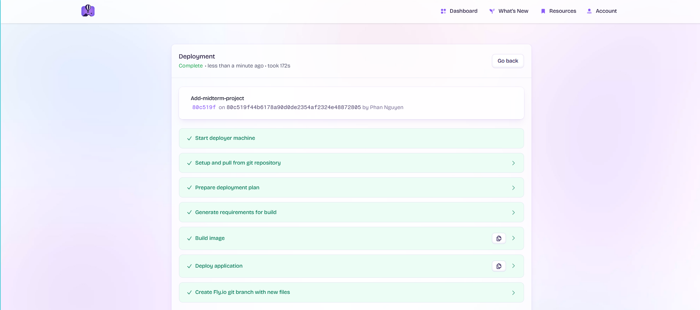
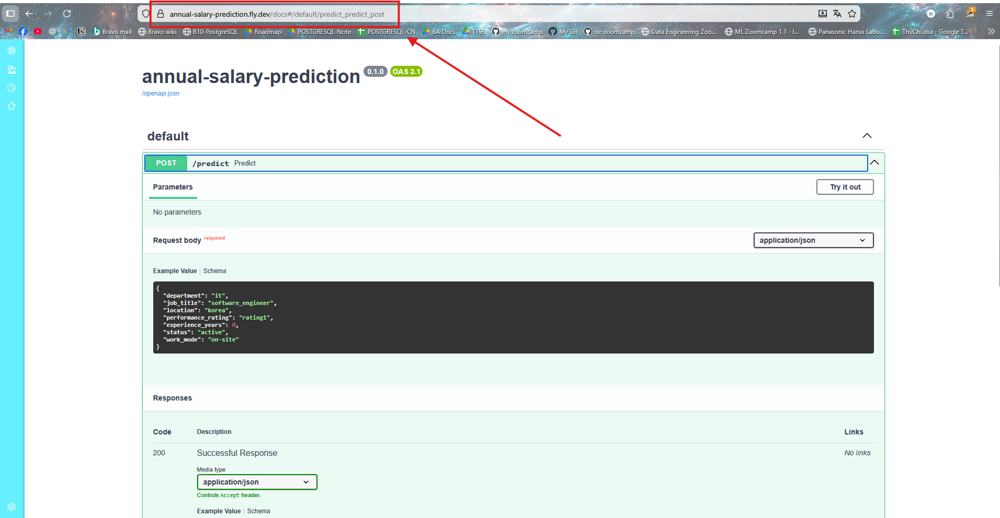
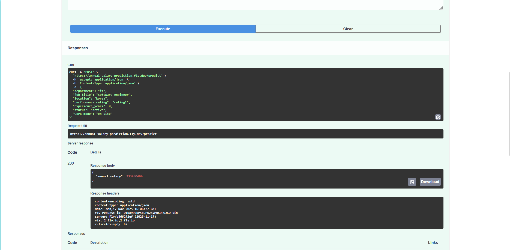

<div align="center">

# 💼 Annual Salary Prediction

**An end-to-end Machine Learning project** — from data exploration to a containerized REST API deployed on the cloud.

*Submitted as ML-Zoomcamp Midterm Project*

[](https://www.python.org/)
[](https://xgboost.readthedocs.io/)
[](https://fastapi.tiangolo.com/)
[](https://www.docker.com/)
[](https://fly.io/)
[](https://docs.astral.sh/uv/)

</div>

---

## 📌 Problem Statement

In competitive recruiting, salary negotiation is a high-stakes moment. After candidates clear multiple interview rounds, they reach the final offer stage — but many decline to disclose their current compensation, leaving HR teams to guess.

**Getting this wrong is costly:**

| Scenario | Consequence |
|---|---|
| Offer too low | Candidate declines → recruitment cycle restarts |
| Offer too high | Exceeds budget → financial impact or internal inequity |
| Offer on target | Deal closed, team grows ✅ |

This project trains a regression model that **predicts a candidate's expected annual salary in VND**, using structured profile data that HR teams already collect during the interview process — department, job title, years of experience, location, performance rating, employment status, and work mode.

---

## 🗂️ Dataset

| Attribute | Detail |
|---|---|
| **Source** | [Kaggle — HR Data MNC](https://www.kaggle.com/datasets/rohitgrewal/hr-data-mnc) by Rohit Grewal |
| **File** | `HR_Data_MNC_Data Science Lovers.csv` |
| **Original Size** | 2,000,000 rows × 12 columns |
| **Training Subset** | 600,000 rows (30% random sample, `random_state=42`) |
| **Missing Values** | None |
| **Target Variable** | `Salary_INR` → converted to `Salary_VND` |

### Raw Columns

| Column | Type | Description |
|---|---|---|
| `Employee_ID` | string | Unique identifier — **dropped** |
| `Full_Name` | string | PII — **dropped** |
| `Department` | categorical | IT, Sales, Finance, HR, R&D, Marketing, Operations |
| `Job_Title` | categorical | 29 distinct roles |
| `Hire_Date` | date | Converted to year; **dropped** (collinear with Experience_Years) |
| `Location` | string | City, Country — country extracted |
| `Performance_Rating` | int (1–5) | Mapped to `rating1`–`rating5` |
| `Experience_Years` | int | Years of professional experience |
| `Status` | categorical | Active / Resigned / Retired / Terminated |
| `Work_Mode` | categorical | On-site / Remote |
| `Salary_INR` | float | Annual salary in Indian Rupees → **target** |

---

## 🏗️ Project Structure

```text
annual-salary-prediction/
│
├── notebooks/                          # Ordered experiment notebooks
│   ├── 01_eda_and_preprocessing.ipynb  # Data exploration & cleaning
│   ├── 02_train_linear_regression.ipynb
│   ├── 03_train_decision_tree.ipynb
│   ├── 04_train_random_forest.ipynb
│   ├── 05_train_xgboost.ipynb          # Hyperparameter tuning (final model)
│   ├── 06_final_train.ipynb            # Full training run
│   └── 07_predict_test.ipynb           # Inference testing
│
├── src/                                # Production source code
│   ├── train.py                        # Download data, train, serialize model
│   ├── predict.py                      # FastAPI inference server
│   ├── test.py                         # HTTP client test script
│   └── predict_test.py                 # Alternate test scratchpad
│
├── models/
│   └── ml_xgboost.bin                  # Serialized (DictVectorizer, XGBModel)
│
├── docs/                               # Screenshots & assets
│   ├── deploy_model_fly.io.png
│   ├── fastapi_docs_fly.io.png
│   └── try_it_out_done.png
│
├── Dockerfile                          # Container image (python:3.12.10-slim)
├── fly.toml                            # Fly.io app config (1 shared CPU, 1GB RAM)
├── pyproject.toml                      # Project metadata & pinned dependencies
├── uv.lock                             # Fully reproducible lock file
├── .python-version                     # Python version pin for uv
└── README.md
```

---

## ⚙️ ML Pipeline

```
Raw Dataset (2M rows)
      │
      ▼
 Sample 30% → 600K rows
      │
      ▼
 Drop: Employee_ID, Full_Name, Unnamed:0
 Drop: Hire_Date  (high correlation with Experience_Years)
      │
      ▼
 Location: "City, Country" → extract Country only
 Salary_INR → Salary_VND  (× 296.77)
 Performance_Rating: int → "rating1"–"rating5"
 Text columns: lowercase + replace spaces with "_"
      │
      ▼
 Target: np.log1p(Salary_VND)    ← handles right-skewed distribution
      │
      ▼
 DictVectorizer  →  one-hot encode categoricals + passthrough numerics
      │
      ▼
 Train / Validate / Test split
      │
      ▼
 Model Training (4 algorithms evaluated)
      │
      ▼
 Best model serialized:  pickle(DictVectorizer, XGBModel)  →  models/ml_xgboost.bin
```

---

## 🤖 Model Training & Selection

Four regressors were trained and evaluated. Metrics are reported on the **log-transformed** target (`np.log1p(Salary_VND)`):

| Model | Key Hyperparameters | RMSE ↓ | R² ↑ | MAPE ↓ |
|---|---|:---:|:---:|:---:|
| Linear Regression | — default — | 0.287 | 0.498 | 1.3% |
| Decision Tree | `max_depth=10`, `max_leaf_nodes=15`, `min_samples_leaf=4200` | 0.288 | 0.495 | 1.3% |
| Random Forest | `n_estimators=45`, `max_depth=10`, `max_features=150` | 0.288 | 0.495 | 1.3% |
| **XGBoost ✅** | See below | **0.289** | **0.491** | **1.3%** |

### Final XGBoost Configuration

```python
xgb_params = {
    'eta': 0.3,                    # Learning rate
    'max_depth': 10,               # Maximum tree depth
    'min_child_weight': 1,         # Minimum sum of instance weight in a child
    'objective': 'reg:squarederror',
    'nthread': 8,
    'eval_metric': 'rmse',
    'seed': 42,
}
num_boost_round = 81
```

> **Why XGBoost?** All four models converge to nearly identical RMSE (~0.288) and MAPE (1.3%). XGBoost was selected as the production model for its **training speed**, **built-in regularisation**, and **scalability** — making it the most practical choice for future retraining on the full 2M-row dataset.

---

## 🌐 API Reference

The inference server exposes a single `POST /predict` endpoint.

**Base URL (local):** `http://localhost:9696`

### `POST /predict`

#### Request Body

```json
{
  "department": "it",
  "job_title": "software_engineer",
  "location": "korea",
  "performance_rating": "rating2",
  "experience_years": 4,
  "status": "active",
  "work_mode": "on-site"
}
```

#### Field Reference

| Field | Type | Valid Values |
|---|---|---|
| `department` | string | `it` · `sales` · `operations` · `marketing` · `finance` · `hr` · `r&d` |
| `job_title` | string | `software_engineer` · `sales_executive` · `operations_executive` · `account_manager` · `marketing_executive` · `data_analyst` · `accountant` · `devops_engineer` · `logistics_coordinator` · `hr_executive` · `seo_specialist` · `business_development_manager` · `financial_analyst` · `it_manager` · `research_scientist` · `talent_acquisition_specialist` · `supply_chain_manager` · `content_strategist` · `cto` · `finance_manager` · `product_developer` · `hr_manager` · `sales_director` · `operations_director` · `lab_technician` · `brand_manager` · `cfo` · `hr_director` · `innovation_manager` |
| `location` | string | `korea` · `congo` · `bouvet_island_(bouvetoya)` · `western_sahara` · `iceland` · `lebanon` · `palestinian_territory` · `montenegro` · `saint_helena` · `cook_islands` |
| `performance_rating` | string | `rating1` · `rating2` · `rating3` · `rating4` · `rating5` |
| `experience_years` | int | `≥ 0` |
| `status` | string | `active` · `resigned` · `retired` · `terminated` |
| `work_mode` | string | `on-site` · `remote` |

#### Response Body

```json
{
  "annual_salary": 285432000
}
```

The `annual_salary` field is the predicted gross annual compensation in **VND (Vietnamese Dong)**, returned as an integer.

---

## 🛠️ Setup & Local Development

### Prerequisites

- Python 3.12+
- [`uv`](https://docs.astral.sh/uv/) package manager

### 1. Install `uv`

```bash
pip install uv
```

### 2. Sync the Environment

Reproduces the exact environment from `uv.lock`:

```bash
uv sync --locked
```

This installs all production dependencies: `fastapi`, `xgboost`, `scikit-learn`, `pydantic`, `uvicorn`, `requests`.

> ⚠️ **To retrain the model locally**, you also need:
> ```bash
> uv pip install kagglehub[pandas-datasets] pandas
> ```

---

## 🚀 Running the Project

### Step 1 — Train & Serialize the Model

Downloads the dataset from Kaggle, runs the full pipeline, and saves the model to `models/ml_xgboost.bin`:

```bash
uv run python src/train.py
```

> Skip this step if `models/ml_xgboost.bin` already exists.

### Step 2 — Start the API Server

```bash
uv run uvicorn src.predict:app --host 0.0.0.0 --port 9696 --reload
```

The server will be available at: `http://localhost:9696`  
Interactive Swagger docs: `http://localhost:9696/docs`

### Step 3 — Send a Test Prediction

```bash
uv run python src/test.py
```

Expected output:

```
The candidates predicted annual salary is 285432000 VND
```

Or test directly with `curl`:

```bash
curl -X POST http://localhost:9696/predict \
  -H "Content-Type: application/json" \
  -d '{
    "department": "it",
    "job_title": "software_engineer",
    "location": "korea",
    "performance_rating": "rating2",
    "experience_years": 4,
    "status": "active",
    "work_mode": "on-site"
  }'
```

---

## 🐳 Containerization

The app is packaged using a minimal `python:3.12.10-slim-bookworm` image with `uv` for dependency installation.

```bash
# Build the image
docker build -t predict-annual-salary .

# Run the container
docker run -it --rm -p 9696:9696 predict-annual-salary
```

The container copies only the files needed for inference (`src/predict.py` + `models/ml_xgboost.bin`) — training code and notebooks are excluded, keeping the image lean.

---

## ☁️ Cloud Deployment — Fly.io

The app is deployed on [Fly.io](https://fly.io) using the configuration in `fly.toml`:

| Setting | Value |
|---|---|
| App name | `annual-salary-prediction` |
| Region | `iad` (Washington D.C.) |
| CPU | 1 shared vCPU |
| Memory | 1 GB |
| Port | 9696 (internal) → HTTPS (external) |
| Auto-stop | Enabled (scales to zero when idle) |

### Deploy Commands

```bash
# Sign up / log in
fly auth signup

# Create the app (auto-generates a name)
fly launch --generate-name

# Deploy
fly deploy

# Destroy when done testing (to avoid charges)
fly apps destroy <app-name>
```

---

## 📸 Screenshots

**App running live on Fly.io:**



**Auto-generated FastAPI `/docs` UI:**



**Live prediction via Swagger "Try it out":**



---

## 🔗 Tech Stack

| Layer | Technology |
|---|---|
| Language | Python 3.12 |
| ML Framework | XGBoost 3.1, scikit-learn 1.7 |
| Feature Encoding | `DictVectorizer` (sklearn) |
| Serialization | `pickle` |
| API Framework | FastAPI + Uvicorn |
| Input Validation | Pydantic v2 |
| Package Manager | `uv` |
| Containerization | Docker (python:3.12.10-slim-bookworm) |
| Cloud Platform | Fly.io |
| Dataset Source | Kaggle (`kagglehub`) |